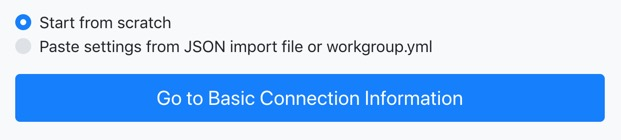
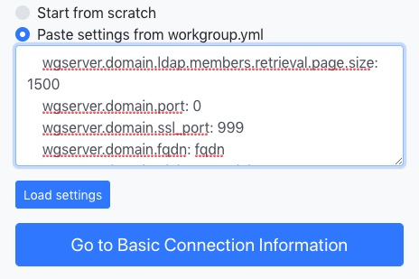
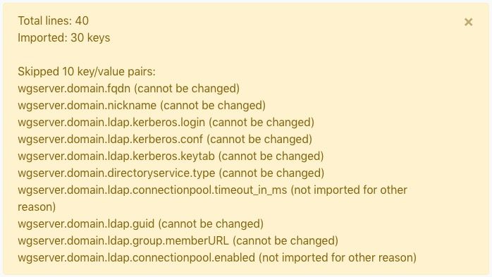

# Tableau LDAP Identity Store Configuration Tool

This tool is designed to help you create/modify your LDAP settings for Tableau Server 2018.3+.  

Run this tool on [Github Pages](https://tagyoureit.github.io/tableau-identitystore-config-tool/).

## Inputs and Outputs

### Inputs are:
* Directly inputted via the UI
* Import YAML settings

### Output are:
* a JSON [identity store](https://onlinehelp.tableau.com/current/server-linux/en-us/plan_identity_store.htm) template/file to use during installation. 
* TSM commands to change appropriate values post-installation (either all commands or only ones that have changed via the GUI)


## Overview

Tableau supports LDAP as an [identity store](https://onlinehelp.tableau.com/current/server-linux/en-us/plan_identity_store.htm) starting with version 2018.3 (both Windows/Linux).  During installation, you must choose an identity store schema.  Identity stores are either internal (local authentication) or external (Active Directory or LDAP) and this choice cannot be changed after the installation.  While local auth and AD are relative straightforward to implement, LDAP can be more difficult because of it's ability to be customized for each organization.  Currently, you also need to use the TSM CLI if you want to enable LDAP.  

Tableau provides [example files](https://onlinehelp.tableau.com/current/server-linux/en-us/entity_identity_store.htm) but they are not easy for non-LDAP admins to understand.  

This tool aims to make it easier for Tableau Admins to input (or ask their LDAP administrator for) the correct entries to configure Tableau.

Further, if you have already installed Tableau with LDAP and it isn't working this tool can help you change the appropriate settings (and give you some troubleshooting steps, below).

### Using the tool with a fresh start (Start from Scratch)
If you have not installed your Tableau Server yet, these are the directions for you.

1. Choose "Start from Scratch"




1. Input the values on the appropriate pages in coordination with your LDAP admin.  If you do not know the right values, chances are you will not be able to guess and get the results you expect.

1. On the finalize screen, download/copy the template in "View configuration file for install".  You are now ready to [Configure the Initial Node Settings](https://onlinehelp.tableau.com/current/server-linux/en-us/config_general.htm).


### Using the tool to modify your LDAP server settings
If you have already installed your Tableau Server but LDAP isn't working (or you want to generate an import template from your existing settings), follow these directions.

1. You can import your relevant workground.yml settings.  The reason for importing the settings from the file directly is that you can get some of the values from TSM Commands but the workgroup.yml files will have all of the settings.
1. Run the appropriate Windows/Linux commands below to retrieve the relevant LDAP settings. The output should have ~40 keys that will resemble:
```
wgserver.domain.ldap.members.retrieval.page.size: 1500
wgserver.domain.port: 0
wgserver.domain.ssl_port: 636
... and a lot more
```

##### Linux - Retrieve yml settings
* Navigate to `/var/opt/tableau/tableau_server/data/tabsvc/config/vizportal_0.<version>` or the location of your Tableau Server installation.
* Run `grep "wgserver.domain" workgroup.yml`.  

##### Windows - Retrieve yml settings
* Navigate to `<TableauServerRootDirectory>/\Tableau Server\data\tabsvc\services\vizportal_0.<version>\config>`
* Run `findstr "wgserver.domain" workgroup.yml`

3. Copy the contents into the "Paste settings from workgroup.yml" import box.

4. Click Load Settings. An informational message will be shown.  *Note: not all settings will be imported.  Some are not directly related to LDAP and some cannot be changed.*

5. Make any changes on the subsequent pages.
6. On the finalize screen, you can download a brand new config file, all of the TSM commands, or only the TSM commands that you have changed after importing your settings.
7. Run the appropriate TSM commands on your server or a TSM client machine.
8. Run the [verify-group-mappings](https://onlinehelp.tableau.com/current/server/en-us/cli_user-identity_tsm.htm#TSMverify-group-mappings) and [verify-user-mappings](https://onlinehelp.tableau.com/current/server/en-us/cli_user-identity_tsm.htm#TSMIDverify-user-mappings__[options]) commands to ensure your LDAP configuration is correct.  You do not need to restart the server to test the imported commands.  See troubleshooting steps below for more information on these commands
9. If you recieve valid responses for the above two commands then commit the changes by running [tsm pending-changes apply](https://onlinehelp.tableau.com/current/server-linux/en-us/cli_pending-changes.htm#pending-changes-apply).  If not, return to Step 5.


# LDAP Settings Reference
Tableau provides a reference for all commands in the [help](https://onlinehelp.tableau.com/current/server-linux/en-us/ldap_config.htm) article.  Please refer to these if you have any questions about specific entries.

# Troubleshooting
Troubleshooting LDAP can be a tricky thing.  Following these tips will help you be successful.  

The first tip is to work with your LDAP administrator to make sure you have the appropriate resource who can help debug any LDAP queries.  Guessing at the right values will never lead to success.

## How Tableau LDAP uses these settings.
1. Basic Connection Screen - Everything on this screen is used to establish the basic connection to the LDAP server (except for Kerberos).
1. Kerberos Connection - If you are using Kerberose, enter the principal name on this screen.  Follow the [Configure Kerberos](https://onlinehelp.tableau.com/current/server/en-us/config_kerberos.htm) instructions for how to upload your config file and keytab to Tableau Server.
1. User and Group Query pages - Tableau uses each of these settings on these pages to query the respective items and they are used (generally) in this order:
    1. Where should the query be run (Base DN)
    1. What should be queried (base filter)
    1. Given the results, what is the user/group (class names)
    1. Now that we have the user/groups, map them to appropriate Tableau values (attributes)
1. Miscellaneous settings - see the aforementioned reference for these settings.  If you do not know if your server supports them, do not change them.


## verify-group-mappings
This is a TSM command line that allows you to make sure the group mappings are correct.  It is run as `tsm user-identity-store verify-group-mappings -v your_group`.  [Help for this command.](https://onlinehelp.tableau.com/current/server/en-us/cli_user-identity_tsm.htm#TSMverify-group-mappings)

If your LDAP Group settings are correct, you should see results that resemble the following:
```
Distinguished Name: cn=your_group,ou=groups,dc=company,dc=com
              GUID: Not found
       Description: Not found
             Email: Not found
 Number of members: 31
```
The important piece is the `Number of members`.  If that value returns the right number of people, you probably have the right settings.

## verify-user-mappings
This is a TSM command line that allows you to make sure the user mappings are correct.  It is run as `tsm user-identity-store verify-user-mappings -v your_user`.  [Help for this command.](https://onlinehelp.tableau.com/current/server/en-us/cli_user-identity_tsm.htm#TSMverify-user-mappings)

If your LDAP User settings are correct, you should see results that resemble the following:
```
Distinguished Name: uid=your_user,ou=people,dc=company,dc=com
              GUID: Not found
          Username: your_user
      Display Name: Your User
             Email: Not found
        JPEG Photo: Not found
         Thumbnail: Not found
```
The important piece is the `username` and `display name`.  If those valuesare correct for the given user, you probably have the right settings.

## LDAPSearch
LDAPSearch is a command line tool to query LDAP servers.   You can roughly map the user/group settings to ldapsearch commands to see if they return the right results.  A typical LDAPSearch command looks like this:
`ldapsearch -D "root" -b "base" "filter"`

You can map the User Base DN and User Base Filter into the LDAPSearch and see if you get results back.

For example, if the following LDAP Search works:
` ldapsearch -w password -h ldap.forumsys.com -D "uid=tesla,dc=example,dc=com" -b "dc=example,dc=com" "objectClass=inetOrgPerson"`

Then your User Base DN should be "dc=example,dc=com" and the User Base Filter should be "objectClass=inetOrgPerson".

Similarly for groups, if the following query works:
`ldapsearch -w password -h ldap.forumsys.com -D "uid=tesla,dc=example,dc=com" -b "dc=example,dc=com" "objectClass=groupOfUniqueNames"`

Then your Group Base DN would be "dc=example,dc=com" and the User Base Filter should be "objectClass=groupOfUniqueNames".

Note: in this example groups and users are stored at the root but that isn't typcially the case in enterprise delpoyments.  If users are stored in an organizational unit (OU) that is "people" then the User Base DN would be "o=people,dc=example,dc=com".
